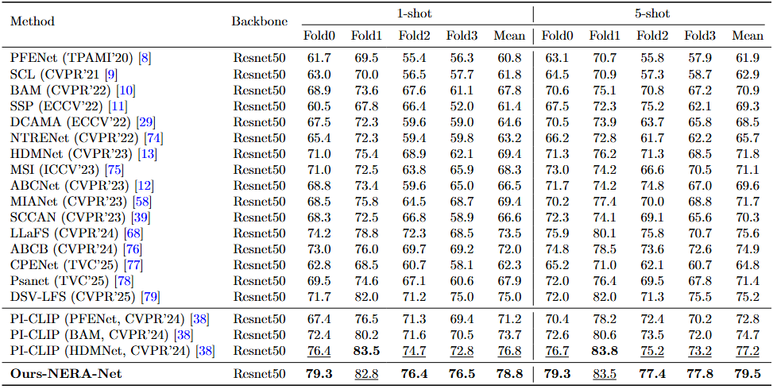
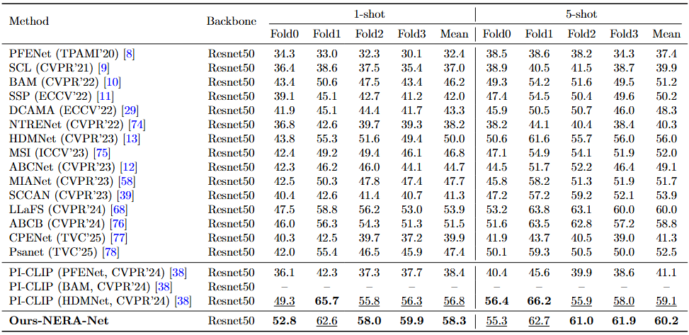
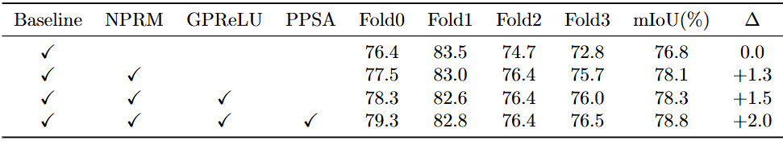
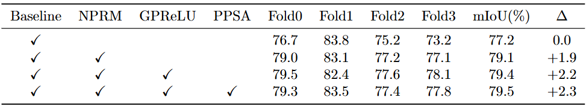

# NERA-Net：Enhancing Few-Shot Semantic Segmentation via Nested Feature Refinement and Alignment

Please note that the experimental results may vary due to different environments and settings. In all experiments on PASCAL-5{i} and COCO-20{i}, the images are set to 473×473.

**Abstract:** Few-shot semantic segmentation (FSSS) faces challenges due to limited annotated data, leading to performance bottlenecks. However, in existing methods, spatial details suffer from irreversible loss at the early inference stage, forming a bottleneck that hinders performance breakthroughs. This paper introduces NERA-Net, a novel framework designed to address these challenges by focusing on intrinsic feature enhancement. NERA-Net employs a Nested Pyramid Refinement Module (NPRM) to recover spatial details and a Prototype-Pixel Semantic Alignment (PPSA) module to enhance feature discriminability. Additionally, the Generalized Parametric Rectified Linear Unit (GPReLU) is introduced to optimize gradient flow. Experiments on PASCAL-5i and COCO-20i benchmarks demonstrate that NERA-Net achieves state-of-the-art performance, with significant improvements in mIoU (e.g.,+2.0\% and +2.3\% on PASCAL-5\textsuperscript{i} under 1-shot and 5-shot settings, respectively.). Our approach exhibits superior convergence efficiency and object perception capabilities, offering a promising solution for FSSS tasks.

# Visualization results.

<strong>Segmentation Results.</strong>

<strong>Prior Activation Maps.</strong>

# Installation

<pre>
Check requirements.txt file for packages
</pre>

# Dataset

Please download the following datasets and put them into the <code>'../data'</code> directory.:

PASCAL-5i: [PASCAL VOC 2012](http://host.robots.ox.ac.uk/pascal/VOC/voc2012/) and [SBD](https://www.cs.cornell.edu/~bharathh/).

COCO-20i: [COCO 2014](https://cocodataset.org/#download).

The lists generation are followed [PFENet](https://github.com/JIA-Lab-research/PFENet). You can direct download and put them into the <code>'./lists'</code> directory.

Before running the code, you should generate the annotations for base classes by running util <code>'/get_mulway_base_data.py'</code>, more details are available at [BAM](https://github.com/chunbolang/BAM).

# Models

We retrained part of the backbone network to adapt it to our proposed Nested Pyramid Refinement Module(NPRM), placing them in the <code>'../initmodel'</code> directory.

Download CLIP pre-trained ViT-B/16 at [here](https://openaipublic.azureedge.net/clip/models/5806e77cd80f8b59890b7e101eabd078d9fb84e6937f9e85e4ecb61988df416f/ViT-B-16.pt) and put it to <code>‘../initmodel/clip’</code>

# Experiments

The experimental results of this study are presented below.

<strong>PASCAL.</strong>

<strong>COCO.</strong>

<strong>Ablation study under 1-shot setting on PASCAL.</strong>

<strong>Ablation study under 5-shot setting on PASCAL.</strong>

<strong>Ablation study on convergence speed under the 1‑shot setting on PASCAL.</strong>

