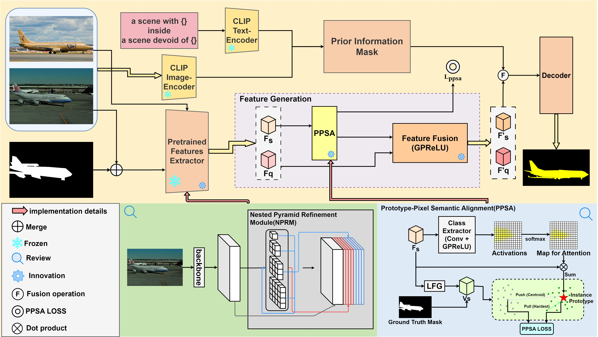

# NERA-Net：Enhancing Few-Shot Semantic Segmentation via Nested Feature Refinement and Alignment

All code and data generated during this study will be made publicly available once the paper is officially accepted for publication.
